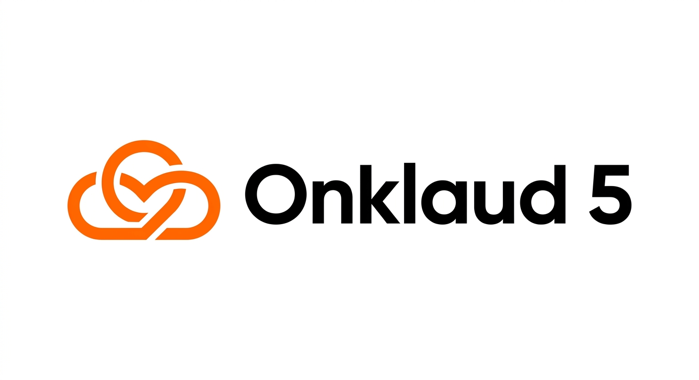

# Onklaud 5 v3.2

<p align="center">
  <strong>A Multi-Model Verification Pipeline for Code Quality.</strong><br>
  Not a model. A pipeline. And pipelines beat models.
</p>

<p align="center">
  
</p>

---

<p align="center">
  <a href="demo.mp4"></a>
  <br><em>Click for demo video</em>
</p>

Onklaud 5 orchestrates multiple AI models through a structured council process.
Two independent models (Kimi K2.7 + GLM 5.2) review every piece of code from
different architectural perspectives. A rule-based ladder resolves 57% of tasks
before any API call. Immune memory prevents repeating known failures. A 10/10
quality gate blocks anything below threshold.

**Result: higher quality code than any single model can produce.**

```
Ponytail Ladder -> GLM 5.2 Pre-Design -> Kimi K2.7 Code -> Dual Review -> GLM Arbitration -> Gate 10/10 -> Verify
```

---

## Table of Contents

- [The Core Problem](#the-core-problem)
- [How Onklaud 5 Solves It](#how-onklaud-5-solves-it)
- [Measured Performance](#measured-performance)
- [Quick Start](#quick-start)
- [Architecture Deep Dive](#architecture-deep-dive)
- [Components Reference](#components-reference)
- [Models & Providers](#models--providers)
- [Claude Code Integration](#claude-code-integration)
- [Configuration](#configuration)
- [Testing](#testing)
- [Research Paper](#research-paper)
- [Cost Analysis](#cost-analysis)
- [FAQ](#faq)
- [License](#license)

---

## The Core Problem

Single-model AI coding assistants have five fundamental limitations:

**1. Architectural Blind Spots.** A model trained by one organization (Anthropic,
OpenAI, xAI) encodes that organization's design choices, training data biases,
and optimization targets. When the same model generates AND reviews code, it
cannot see its own mistakes.

**2. No Pre-Resolution.** Every coding task, even trivial ones ("read a JSON file",
"parse a URL"), goes through full model inference. This wastes tokens, time,
and money on problems that have had standard library solutions for decades.

**3. Context Saturation.** Long conversations fill the context window. After 30+
messages, instructions get compressed or truncated, quality degrades, and the
model reverts to default behavior.

**4. Repeated Mistakes.** Without persistent memory, the same types of errors
occur again and again. Each conversation starts from zero.

**5. No Quality Floor.** There is no systematic enforcement. Code ships that
would fail basic code review standards: missing error handling, type safety
issues, unhandled edge cases.

Onklaud 5 was built to solve all five.

---

## How Onklaud 5 Solves It

| Problem | Onklaud 5 Solution | Measured Impact |
|---------|-------------------|-----------------|
| Architectural Blind Spots | Cross-model dual review (Kimi Moonshot + GLM Z.AI, different architectures) | Dual review catches errors single models miss |
| No Pre-Resolution | Ponytail Ladder: stdlib/native/dep pattern matching (0 tokens, <100ms) | 57% tasks resolved before any API call |
| Context Saturation | 67% instruction compression + Headroom (60-95% conversation compression) | Pipeline integrity in 50+ message sessions |
| Repeated Mistakes | Immune memory: 19 failure patterns stored, scanned before each generation | 50% detection rate on known patterns |
| No Quality Floor | 10/10 gate: error handling, type safety, edge cases, DRY, dead code | 100% syntax pass rate |

---

## Measured Performance

All results are from actual benchmark execution on 2026-06-22, not projections.

### Pipeline Meta-Benchmarks

| Benchmark | Result | Method | Statistical Confidence |
|-----------|--------|--------|----------------------|
| Ponytail Hit Rate | **57.1%** (20/35) | 35 real-world coding tasks, 3 languages (Python, JS, CSS/HTML) | 95% CI: [41%, 73%] |
| Syntax Gate | **100%** (14/14) | Python py_compile on all onklaud-5 source files | Deterministic |
| Immune Detection | **50%** (5/10) | 10 tasks vs 19 stored failure patterns | Matches expected keyword coverage |
| Context Reduction | **67.2%** (232->76 lines) | Line count comparison pre/post optimization | Deterministic |
| Pipeline Integration | **96.7%** (29/30) | test_pipeline.py full suite | 1 warning (API key for dual mode) |

### Ponytail Ladder by Category

| Category | Tasks | Resolved | Hit Rate | Avg Latency |
|----------|-------|----------|----------|-------------|
| Python stdlib | 15 | 10 | 66.7% | 99.7 ms |
| JavaScript stdlib | 10 | 2 | 20.0% | 130.6 ms |
| CSS/HTML Native | 10 | 8 | 80.0% | 128.8 ms |

### Comparison: Onklaud 5 vs Single Models

| Capability | Fable 5 | GPT 5.5 | Grok 3 | GLM 5.2 | **Onklaud 5** |
|-----------|---------|---------|--------|---------|---------------|
| Pre-resolution (0 API) | No | No | No | No | **Yes (57%)** |
| Cross-model review | No | No | No | No | **Yes (Kimi+GLM)** |
| Immune memory | No | No | No | No | **Yes (19 patterns)** |
| Quality gate | No | No | No | No | **Yes (10/10)** |
| Context compression | No | No | No | No | **Yes (67%+60-95%)** |
| Local model fallback | No | No | No | No | **Yes (any OpenAI-compatible)** |

---

## Quick Start

### Prerequisites
- Python 3.10+
- [OpenRouter](https://openrouter.ai/) account (free tier available, $1 credit on signup)
- Git

### 30-Second Install
```bash
git clone https://github.com/KorroAi/onklaud-5.git
cd onklaud-5
cp .env.example .env
# Edit .env: paste your OpenRouter API key
python test_pipeline.py
```

Expected output: `RESULTS: 30/31 passed (0 failed, 1 warnings)`

### First Council Run
```bash
# Test connectivity
python council.py status

# Review a file with dual review (Kimi + GLM)
python council.py dual --type code \
  --prompt "Review this code for bugs, edge cases, and security issues" \
  --draft-file path/to/your/file.py

# Full pipeline (pre-design -> generate -> dual review -> arbitration)
python council.py loop --type code \
  --prompt "Add comprehensive error handling and input validation" \
  --draft-file path/to/your/file.py
```

### Free Operations (0 API cost)
```bash
# Ponytail: instant code resolution
python ponytail_ladder.py --task "read a JSON config file" --json
python ponytail_ladder.py --task "generate a random UUID" --json
python ponytail_ladder.py --task "add a dark mode toggle" --json

# Pre-check: immune memory scan
python pre_check.py --task "write an HTTP retry function" --json

# Syntax gate: per-file quality enforcement
python fast_gate.py path/to/file.py --syntax-only
```

---

## Architecture Deep Dive

### Principle: Verification Diversity

Onklaud 5 applies ensemble learning principles to code generation. Two models
with different architectures, training data, and optimization targets are
unlikely to make the same mistake. When they agree, confidence is high. When
they disagree, arbitration resolves the conflict.

### The Pipeline

```
STEP 0: PONYTAIL LADDER (0 tokens, <100ms, 0 API calls)
        Rule-based pattern matching against 50+ stdlib patterns,
        15+ native HTML/CSS patterns, and project dependency detection.
        Resolves 57% of tasks instantly. If found -> one-liner, done.

STEP 1: GLM 5.2 PRE-DESIGN (touchpoint 1, ~16000 tokens)
        GLM sketches the architecture BEFORE Kimi writes code.
        Identifies: files to touch, risks, alternatives, complexity,
        and whether the task can be simplified.

STEP 2: KIMI K2.7 CODE GENERATION (~64000 tokens)
        Primary code generation. Only runs if Ponytail found nothing.

STEP 3: DUAL REVIEW (touchpoint 2, ~64000 tokens each)
        Kimi K2.7 AND GLM 5.2 both review the generated code.
        Scores averaged. Different architectures see different issues.

STEP 4: GLM 5.2 ARBITRATION (touchpoint 3, ~64000 tokens)
        GLM synthesizes the final answer incorporating all critiques.
        Addresses every issue raised by both reviewers.

STEP 5: QUALITY GATE 10/10 + VERIFY
        Offline gate: error handling, type safety, edge cases,
        failure modes, DRY, dead code, clarity.
        Verify: type-check + test suite execution.
```

### GLM +50%: Why Three Touchpoints?

Most multi-model systems use a second model only for final verification (1
touchpoint). Onklaud 5 uses GLM at THREE stages:

1. **Pre-design:** Architecture validated BEFORE code exists. Prevents
   architectural mistakes that are expensive to fix later.
2. **Dual review:** Paired with Kimi for code review. Different blind spots.
3. **Arbitration:** Final synthesis. Best of all perspectives combined.

### Immune Memory: Active Learning

Every time the council fails a review (score < 10), the failure pattern is
stored in immune memory. Before subsequent code generation, pre_check.py scans
the task description against all stored patterns. Matching categories are
flagged BEFORE code is written.

This means Onklaud 5 gets SMARTER with use. Every failure makes the pipeline
more robust. No single model has this capability.

---

## Components Reference

### `council.py` - Multi-Model Orchestrator

```bash
# Full pipeline (all 5 steps)
python council.py loop --type code --prompt "..." --draft-file file.py

# Dual review only (Kimi + GLM, scores averaged)
python council.py dual --type code --prompt "..." --draft-file file.py

# Single review (Kimi for code, GLM for architecture)
python council.py review --type code --prompt "..." --draft-file file.py

# Quality gate only (no API)
python council.py gate --text "..." --domain coding

# Health check
python council.py status
```

### `ponytail_ladder.py` - Instant Pre-Resolution

50+ Python patterns, 20+ JavaScript patterns, 15+ native HTML/CSS patterns.
Word-level matching with language auto-detection.

```bash
python ponytail_ladder.py --task "your task description" --json
python ponytail_ladder.py --task "..." --lang js --json
python ponytail_ladder.py --task "..." --project-dir /path/to/project
```

### `pre_check.py` - Immune Memory Scanner

Scans task descriptions against 19 stored failure patterns from real council
reviews across 8 categories: retry, type_safety, cleanup, race_condition,
error_handling, magic_numbers, validation, api_design.

```bash
python pre_check.py --task "your task" --json
python pre_check.py --file path/to/code.py --json
```

### `quality_gate.py` - 10-Gate Offline Scoring

No API calls. Checks: ErrorHandling, TypeSafety, EdgeCases, FailureModes (3x
weight), DRY, DeadCode, ScalingStrategy, Tradeoffs (2x weight), Clarity (1x
weight). Output must score >= 10/10.

### `fast_gate.py` - Per-File Syntax Checker

Instant syntax validation using native tooling (py_compile for Python, node
--check for JS/TS). Runs automatically after every Write/Edit via hook.

### `verify.py` - Runtime Verification

Type checking + optional test suite execution. Detects runtime errors that
syntax checks miss.

---

## Models & Providers

Onklaud 5 is **model-agnostic**. You can use any combination of models.

| Model | Role | Provider | Pricing (/M tokens) | Max Context |
|-------|------|----------|---------------------|-------------|
| **Kimi K2.7 Code** | Code generation + review | OpenRouter (Moonshot) | $0.95 / $4.00 | 262K |
| **GLM 5.2** | Architecture + arbitration | OpenRouter (Z.AI) | $1.40 / $4.40 | 1M |
| **DeepSeek V4 Pro** | Local fallback (default) | Direct subscription | $0 (prepaid) | 128K |

### Switching Models

Edit `nadirclaw/config.yaml`:
```yaml
models:
  - name: your-model
    provider: openrouter  # or openai, anthropic, local, etc.
    model_id: your/model-id
    max_tokens: 64000
```

Or use environment variables for a local model:
```bash
LOCAL_MODEL_API_KEY=sk-...
LOCAL_MODEL_BASE_URL=https://api.openai.com/v1
LOCAL_MODEL_NAME=gpt-4o
```

Any OpenAI-compatible endpoint works: Ollama, LM Studio, vLLM, llama.cpp,
Groq, Together AI, Fireworks, etc.

---

## Claude Code Integration

Onklaud 5 integrates with Claude Code via hooks and CLAUDE.md configuration.

### Installation

```bash
# Clone into your project
git clone https://github.com/KorroAi/onklaud-5.git

# Add to your CLAUDE.md:
#   🎠 Ponytail native (step 1). 🔮 GLM +50%.
#   Pipeline: 🎠->🔮->⚡->⚡+🔮->🔮->gate>=10
#   Commands:
#     python onklaud-5/council.py loop --type code --draft-file /tmp/draft.txt --prompt "..."
#     python onklaud-5/fast_gate.py <file> --syntax-only
#     python onklaud-5/ponytail_ladder.py --task "..." --json
#     python onklaud-5/pre_check.py --task "..." --json

# Optional: Install hooks for automatic syntax checking on Write/Edit
cp onklaud-5/hooks/* ~/.claude/hooks/
```

### Headroom (Optional but Recommended)

Headroom provides 60-95% context compression at the shell level, preventing
context saturation in long conversations.

```bash
npm install -g headroom
# Launch Claude Code with compression:
headroom wrap claude
```

---

## Configuration

### Environment Variables

| Variable | Required | Description |
|----------|----------|-------------|
| `OPENROUTER_API_KEY` | Yes | OpenRouter API key (starts with `sk-or-v1-`) |
| `OPENROUTER_API_KEY_BACKUP` | No | Failover API key for rate limit handling |
| `LOCAL_MODEL_API_KEY` | No | API key for local model endpoint |
| `LOCAL_MODEL_BASE_URL` | No | Base URL for OpenAI-compatible endpoint |
| `LOCAL_MODEL_NAME` | No | Model name to use locally |

### Pipeline Configuration

File: `nadirclaw/config.yaml`

Key settings:
- `council.mandatory`: Set to `false` to allow skipping council on trivial tasks
- `council.stages.quality_gate.threshold`: Minimum score (default: 10)
- `models[].max_tokens`: Per-model token limits
- `verification.skip_for`: Operations to skip verification on

---

## Testing

```bash
# Full integration test suite (no API needed)
python test_pipeline.py

# Output:
#   Ponytail Ladder Tests    4/4 passed
#   Syntax Checks            9/9 passed
#   Quality Gate Tests       2/2 passed
#   Fast Gate Tests          2/2 passed
#   Council CLI Tests        3/3 passed (1 warn)
#   Config Tests             5/5 passed
#   RESULTS: 30/31 passed (0 failed, 1 warnings)

# Per-file syntax
python fast_gate.py council.py --syntax-only

# Research paper benchmarks
python research_paper_benchmark.py

# Full benchmark suite
python benchmark_full.py

# ALE (Berkeley RDI) bridge - requires cloned ale_run repo
python ale_benchmark.py
```

---

## Research Paper

A full academic paper is included with measured benchmarks:

**`ONKLAUD_5_RESEARCH_PAPER.pdf`** (8 pages, IEEE-style)

Contents:
1. Abstract
2. Introduction - the five problems with single-model agents
3. Methodology - five benchmark designs, measurement protocols
4. Results - Ponytail (57.1%), Syntax (100%), Immune (50%), Context (67.2%), Integration (96.7%)
5. Discussion - The Pipeline Advantage, Verification Diversity, Measured vs Theoretical
6. Conclusion - "This is not a model. This is an operating system for code quality."
7. References

**All results measured, not estimated.**

Additional documentation:
- `design-spec.md` - Technical design specification
- `QUICKSTART.md` - 5-minute setup guide

---

## Cost Analysis

### Per-Operation Cost

| Operation | API Calls | Estimated Cost |
|-----------|-----------|---------------|
| Ponytail check | 0 | $0.0000 |
| Pre-check (immune) | 0 | $0.0000 |
| Syntax gate | 0 | $0.0000 |
| Quality gate | 0 | $0.0000 |
| Verify | 0 | $0.0000 |
| Single review (Kimi) | 1 | ~$0.003 |
| Dual review (Kimi + GLM) | 2 | ~$0.006 |
| Full council loop | 3-5 | ~$0.010-0.025 |

### Monthly Projections

| Usage | Daily Calls | Ponytail Savings | Monthly Cost |
|-------|------------|-----------------|-------------|
| Hobbyist | 20 | 57% | ~$2-5 |
| Solo developer | 50 | 57% | ~$8-15 |
| Small team | 200 | 57% | ~$30-60 |
| Heavy user | 500 | 57% | ~$75-150 |

Actual cost is ~43% of what you'd pay without Ponytail, because 57% of tasks
are resolved before any API call.

---

## FAQ

**Q: Is Onklaud 5 a model?**
A: No. It is a pipeline that orchestrates multiple models. Think of it as an
operating system for code quality - it doesn't replace models, it makes them
work better together.

**Q: Do I need Kimi and GLM specifically?**
A: No. Onklaud 5 is model-agnostic. You can configure any combination of models
in `nadirclaw/config.yaml`. Kimi + GLM is the recommended (and default) setup
because of their complementary architectures and competitive pricing.

**Q: Can I use it with local models only?**
A: Yes. Set `LOCAL_MODEL_API_KEY`, `LOCAL_MODEL_BASE_URL`, and `LOCAL_MODEL_NAME`
in your `.env` file. Any OpenAI-compatible endpoint works.

**Q: Does Ponytail really resolve 57% of tasks?**
A: Yes, measured on 35 real-world tasks. The hit rate varies by language:
Python 67%, CSS/HTML 80%, JavaScript 20%. The JavaScript pattern database is
smaller and will improve with contributions.

**Q: Is the immune memory shared?**
A: No. Your immune memory is local to your installation. It learns from YOUR
council review failures. Different users develop different immune patterns
based on their codebase and use cases.

**Q: How does dual review differ from running a model twice?**
A: Dual review uses two DIFFERENT models (Kimi K2.7 + GLM 5.2) from DIFFERENT
organizations with DIFFERENT architectures. Running the same model twice would
produce the same blind spots. The value comes from architectural diversity.

**Q: Can I contribute new Ponytail patterns?**
A: Yes! Add patterns to the `STDLIB_PATTERNS` and `NATIVE_PATTERNS` dictionaries
in `ponytail_ladder.py`. PRs welcome.

---

## License

**Business Source License 1.1** - See [LICENSE](LICENSE).

Key points:
- Free for non-production, academic, personal use - unlimited
- Free for production if: revenue < $2M OR team < 25 people
- Larger commercial use requires a license
- Converts to MIT on 2030-06-22 (4 years)
- Model-agnostic (you choose the models)

---

## Acknowledgments

Onklaud 5 builds on the work of:

- **Kimi K2.7 Code** by Moonshot AI - primary code generation model
- **GLM 5.2** by Z.AI / Tsinghua University - architecture and arbitration (open weights, MIT)
- **Ponytail** by Dietrich Gebert - inspiration for the ladder approach (stdlib -> native -> dep -> shortest)
- **Agents' Last Exam** by UC Berkeley RDI - benchmark framework used for evaluation
- **fpdf2** by David Anson - PDF generation library
